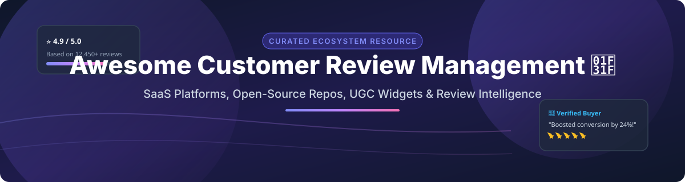

  

# 🌟 Awesome Customer Review Management 🚀

  
  
  
  

---

## 📌 Top Customer Review Management Platforms & Open-Source Ecosystem 🛍️

**A Curated Ecosystem Guide to SaaS Solutions, Open-Source Tools, UGC Widgets, and Customer Intelligence Platforms** 📊

*Last updated: September 2026* 🗓️

---

### 🌐 Market Size & Industry Structure 📈

> [!NOTE]
> The **Customer Experience & Review Management Software Market** is estimated at **~$15 Billion – $22 Billion** (2026) and is projected to exceed **$33 Billion+ by 2030** (CAGR of **~14.4%**). The market structure is **Highly Fragmented**, spanning enterprise CX suites (Qualtrics, Bazaarvoice), specialized e-commerce review apps (Yotpo, Judge.me, Loox), and self-hosted open-source platforms (Formbricks, PostHog, Fider, Astuto).

---

## 📋 Table of Contents 📑

- [🏢 SaaS & Hosted Platforms](#-saas--hosted-platforms)
- [🔓 Open-Source GitHub Projects](#-open-source-github-projects)
- [🤝 How to Contribute](#-how-to-contribute)
- [⚠️ Disclaimer & Open-Source Reality](#%EF%B8%8F-disclaimer--open-source-reality)
- [❤️ Support & Acknowledgments](#%EF%B8%8F-support--acknowledgments)
- [📈 Star History](#-star-history)

---

## 🏢 SaaS & Hosted Platforms ⚡

| Platform 🚀 | Market Size / Valuation / Revenue 💰 | Starting Price 💵 | Free Tier / Free Trial Limits 🎁 | Key Features & Ecosystem Focus 🛠️ |
| :--- | :--- | :--- | :--- | :--- |
| **[Trustpilot](https://www.trustpilot.com/)** | **~$1.4B Market Cap** (LSE: TRST, $200M+ ARR) | $99/month (Billed annually) | **Free Forever Plan** (50–100 automated review invitations/mo limit) | Leading independent public review platform, WooCommerce auto-requests & TrustBox display widgets |
| **[Bazaarvoice](https://www.bazaarvoice.com/)** | **~$1.5B Valuation** (~$201M ARR) | $10,000/year (~$833/mo starting enterprise contract) | **No Free Plan / No Free Trial** (TryIt sampling community is for shoppers only) | Enterprise retail review syndication network (Walmart, Target, Best Buy), UGC moderation |
| **[Yotpo](https://www.yotpo.com/)** | **~$1.4B Valuation** ($100M+ ARR Unicorn) | $15/month (Pro Reviews plan) | **Free Forever Plan** (50 monthly orders limit) | E-commerce marketing suite for reviews, visual UGC, loyalty programs & SMS marketing |
| **[PowerReviews](https://www.powerreviews.com/)** | **~$150M – $300M Valuation** (~$40M ARR) | Custom Quote (Typically $500+/mo for SMB tier) | **No Free Plan / No Free Trial** | Enterprise UGC syndication, review collection & rating analytics for brands and retailers |
| **[Feefo](https://www.feefo.com/)** | **~$100M Valuation** (~$25M ARR) | ~$200/month (£149/mo Essential plan) | **No Free Plan / No Free Trial** | Verified invite-only customer feedback platform, merchant experience management |
| **[Reviews.io](https://www.reviews.io/)** | **~$80M Valuation** (~$18M ARR) | $29/month | **14-Day Free Trial** (Includes 50 review invite credits) | Official Google Shopping & Ads review partner, Klaviyo integration, rich snippet tools |
| **[Loox](https://loox.app/)** | **~$60M Valuation** (~$15M ARR) | $49.99/month (Convert plan) | **14-Day Free Trial** (Free tier supports up to 500 total lifetime orders) | Visual photo & video review display widgets, high-converting social proof for Shopify |
| **[Stamped.io](https://stamped.io/)** | **~$50M Valuation** (Acquired by Tiny Capital) | $23/month (200 monthly orders limit) | **7-Day Free Trial** (No permanent free tier) | In-email review submission widgets, Google Shopping star ratings & loyalty integration |
| **[Judge.me](https://judge.me/)** | **~$45M Valuation** (~$11.2M ARR) | $15/month (Awesome Plan flat) | **Free Forever Plan** (Unlimited review requests & core widgets, no order cap) | Budget-friendly Shopify review app with photo reviews, Q&A widgets & rich SEO snippets |
| **[Okendo](https://www.okendo.io/)** | **~$40M Valuation** (~$10M ARR) | $19/month (Essential Plan) | **Free Forever Plan** (50 monthly orders limit) | Customer marketing platform for DTC Shopify brands combining reviews, quizzes & surveys |

---

## 🔓 Open-Source GitHub Projects 🛠️

Sorted by GitHub Star Count (Descending) 🌟

- **[PostHog](https://github.com/posthog/posthog/stargazers)**  🦔
  - **Open-source product analytics, user feedback surveys, and session recording platform.** Allows teams to trigger in-app customer review prompts, micro-surveys, and feedback widgets.
  - **Tech Stack**: Python, Django, React, TypeScript, ClickHouse, PostgreSQL.
  - **License**: MIT / ELv2.

- **[Formbricks](https://github.com/Formbricks/formbricks/stargazers)**  🧱
  - **Open-source Qualtrics alternative for customer feedback and product reviews.** Conduct targeted in-app, web, and email review collection surveys with granular audience targeting.
  - **Tech Stack**: Next.js, TypeScript, TailwindCSS, PostgreSQL, Prisma.
  - **License**: AGPL-3.0.

- **[OpenPanel](https://github.com/openpanel-dev/openpanel/stargazers)**  📊
  - **Open-source analytics and user event tracking platform with feedback collection capability.** Easily track customer review submission events and evaluate customer sentiment trends.
  - **Tech Stack**: Next.js, TypeScript, ClickHouse, Go.
  - **License**: AGPL-3.0.

- **[Fider](https://github.com/getfider/fider/stargazers)**  💡
  - **Open platform to collect, upvote, and prioritize customer feedback & reviews.** Features public or private feedback boards, OAuth/email login, and roadmap publishing.
  - **Tech Stack**: Go, TypeScript, React, PostgreSQL.
  - **License**: AGPL-3.0.

- **[Feedbin](https://github.com/feedbin/feedbin/stargazers)**  📰
  - **Open-source web webfeed aggregator adaptable for monitoring external brand reviews and news.**
  - **Tech Stack**: Ruby on Rails, PostgreSQL, Redis.
  - **License**: MIT.

- **[Astuto](https://github.com/astuto/astuto/stargazers)**  🇮🇹
  - **Self-hosted customer feedback collection tool inspired by Canny.** Helps product teams collect feedback, track feature requests, and organize community review boards via Docker.
  - **Tech Stack**: Ruby on Rails, Vue.js, PostgreSQL.
  - **License**: MIT.

- **[reviewsup.io](https://github.com/allenyan513/reviewsup.io/stargazers)**  ⚡
  - **Open-source reviews and testimonials management platform.** Purpose-built for developers to collect, manage, and display social proof with widgets for JavaScript, React, and Vue.
  - **Tech Stack**: Node.js, Next.js, NestJS, PostgreSQL, React, TypeScript.
  - **License**: MIT.

- **[Rato](https://github.com/hoochlef/Rato/stargazers)**  🤖
  - **AI-powered business review platform inspired by Trustpilot.** Features automated review summaries, intelligent moderation (detecting spam and hate speech), and merchant profile claiming.
  - **Tech Stack**: FastAPI, PostgreSQL, Next.js, React, Tailwind CSS.
  - **License**: MIT.

- **[VoxAuditor](https://github.com/DaruruGirish/VoxAuditor/stargazers)**  🔍
  - **Product review intelligence engine with local vector database (ChromaDB).** Groups customer complaints via embeddings and enables conversational Q&A over offline review data.
  - **Tech Stack**: Python, FastAPI, ChromaDB, sentence-transformers, React, Docker.
  - **License**: MIT.

- **[Trustpilot WooCommerce Plugin](https://github.com/klader-digital/trustpilot-reviews/stargazers)**  🛒
  - **Trustpilot's official free WooCommerce plugin repository.** Automates post-purchase review request emails and embeds drag-and-drop TrustBox widgets in e-commerce stores.
  - **Tech Stack**: PHP, WordPress, WooCommerce.
  - **License**: GPL-2.0.

- **[Easy Review AliExpress Importer](https://github.com/PhilipHilgendorf/Easy-Review-Aliexpress-Importer/stargazers)**  📦
  - **WooCommerce review importer tool.** Imports product reviews with photos directly from AliExpress into WooCommerce stores, featuring automatic translation via DeepL API.
  - **Tech Stack**: PHP, WordPress, WooCommerce.
  - **License**: GPL-3.0.

---

## 🤝 How to Contribute 🛠️

1. Fork this repository 🍴
2. Create a feature branch (`git checkout -b feature/add-new-tool`)
3. Add your SaaS or Open-Source review tool entry to `README.md` following the exact table or badge format
4. Submit a Pull Request with a clear title and description 🚀

---

## ⚠️ Disclaimer & Open-Source Reality 🔒

- This repository is a **community-curated list** for educational and research purposes.
- Customer review management platforms handle sensitive user data and personal identifiable information (PII). Ensure full compliance with GDPR, CCPA, and FTC guidelines when collecting user-generated content.
- While commercial SaaS platforms (Yotpo, Trustpilot, Bazaarvoice) offer turnkey managed infrastructure and Google Rich Snippets integration, open-source solutions provide complete data privacy, self-hosting flexibility, and zero recurring vendor lock-in.

---

## ❤️ Support & Acknowledgments 🙏

Thank you for exploring and contributing to the **Awesome Customer Review Management** ecosystem! If you find this curated collection helpful, please consider starring, forking, or sharing it with fellow developers and e-commerce managers.

- 🌟 **Star this repository** to show your appreciation and help others discover it!
- ☕ **Buy me a coffee / Sponsor**: Support ongoing maintenance on the [GitHub Sponsor Dashboard](https://github.com/sponsors/ishandutta2007).

---

## 📈 Star History 📊

---

  Maintained with ❤️ by <a href="https://github.com/ishandutta2007">@ishandutta2007</a> and the Open Source Community.

